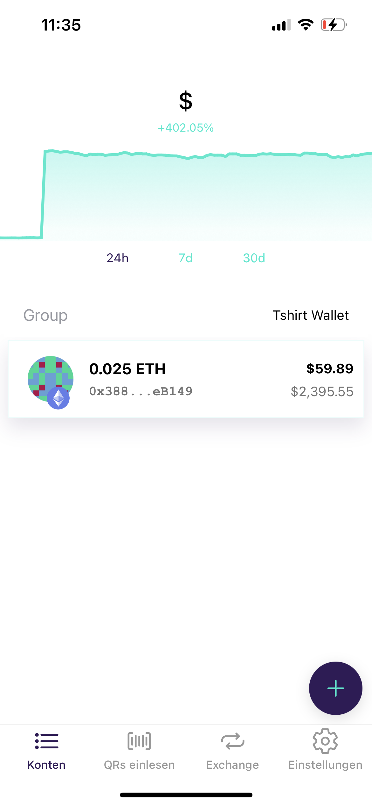

# QR Code Crypto Wallet Decode Project

## Background

There was this guy at the Student Project House (Makerspace) group that challenged everyone to scan his T-shirt and get the $30 out of his crypto wallet. And, I wanted it.

The problem was:
1. I was not physically at the Makerspace, so I couldn't go up to him and scan the QR code
2. The QR code in the picture posted on Slack showed only ~60% of the QR code

But I knew:
1. QR codes are error-resistant: Even if you remove upto 30% of the QR code's content (those little dots), the Reed-Solomon algorithm automatically corrects it to figure out the original content!
2. I wanted that crypto wallet content!

## Goal
1. Decode and get the $30 out of the challenger's wallet via extracting the info from the QR code
2. Create a program that can figure out the correct missing bits of the QR code, if certain parts are occluded!

## Plan
1. Manually copy the dots (bits) of the QR code from the [images](./QR_shirt_images/) and try to scan it bare-bone
   - If that doesn't work, figure out what the QR code means manually by going through the QR code spec (figure out the Error correction level, Mask type, etc.)
2. If that doesn't work, create a program that will fill in the occluded bits and figure out the original QR code content
   - Figure out which QR code spec the T-shirt belongs to
   - Search for existing QR code libraries that supports reading in any QR code formats (string, binary, etc)
   - Create a class that can hold the QR code information
   - Utilize the QR code error correction algorithm to correctly try out different combinations of occluded bits, and verify if the content makes sense

## Information on the QR code itself
- The Crypto Wallet QR code is 33 x 33 (modules), which is Version 4 of the QR code specification, which can hold from 34 to 78 bytes of data depending on error correction level (https://www.qrcode.com/en/about/version.html)

## Process
Quite frankly, I did everything by manual labor via Google Spreadsheet, as I wanted to quickly extract the QR code without much coding.

> [Spreadsheet for QR code link](https://docs.google.com/spreadsheets/d/1ruCe0SqqNNKI6sTPTMH9qu8bGK3hJwg5jye8mQJVXVs/edit?usp=sharing)

I had to go through around 4 different revisions, removing the bits I have wrongfully set in the sheet, by comparing it with the T-shirt photos.

I was speculating at first that first 2 ~ 3 revisions were not getting scanned since the T-shirt's QR code is mirrored version of the official QR code standard (where the position marker should be on the lower-right side, whereas the T-shirt has it on lower-left side).

But, that mystery was solved when on the 4th Iteration, the QR code was successfully read via the QR code reader app :D

It was a fun exercise and making a program that would automatically fetch the potential QR code from the images would be the future target ;)

## Decode result
ethereum:0xaD54a634F88Ef6Ef1De736Dd046Ee571d987B458?amount=0.005

## Conclusion
The Challenge was ill-posed. It is not possible to have a QR code, when scanned would transfer the fund from the account to the scanner's account.

Instead, QR code for Ether Transfer works by having the payer scan the recipient's QR code, after which they can specify the amount to 'send', and actually send the Ether.

> QR codes are only meant for the owner of the account to issue a "Payment Request"!

Source: https://support.blockchain.com/hc/en-us/articles/4417081720596-How-do-I-send-Ether-

Therefore, this QR code, which decodes as: "ethereum:0xaD54a634F88Ef6Ef1De736Dd046Ee571d987B458?amount=0.005" only enables the scanner to **send** the ether to this account (T-shirt Ether Wallet).

In fact, the screenshot the challenger (owner of the wallet) posted on Slack:

Shows the wallet address of "0x388 ... eB149", which does NOT correspond to the ether address embedded in the QR code of the T-shirt (0xaD5 ... 7B458)!

### Ether Network Analysis
A quick search on Etherscan has revealed that the wallet in the T-shirt QR code had 3 transactions in the past:

1. Transfer of 0.012 Ether into the wallet : [Transation Link](https://etherscan.io/tx/0xf37908a5b77a1a95e9ee048e8f2f0dd6746f5947eb8908b50863ae665d72f1ba)
2. Transfer of 0.005 Ether out of the wallet : [Transation Link](https://etherscan.io/tx/0xf93aec8ba4b4cb776ff2d32461c41f7206b450b3e349692ec422a62d5357ab3f)
3. Deposit of 0.001 Ether out of the wallet : [Transation Link](https://etherscan.io/tx/0x25042547b64638ca22de118545c3f057507cb1c00515193e931364ceeae8158d)

> [Link to the T-shirt Wallet](https://etherscan.io/address/0xaD54a634F88Ef6Ef1De736Dd046Ee571d987B458)

An interesting part is the transaction no.2, where the recipient of the 0.005 Ether out of the T-shirt wallet is another wallet: "0x388f533485f0f40A396f845C50eE12D2EbaeB149", which matches exactly what the screenshot of the wallet showed: "0x388 ... eB149".

This wallet has 2 transactions:
1. Transfer of 0.005 Ether from the T-shirt Wallet : [Transation Link](https://etherscan.io/tx/0xf93aec8ba4b4cb776ff2d32461c41f7206b450b3e349692ec422a62d5357ab3f)
2. Transfer of 0.020 Ether into the wallet : [Transaction Link](https://etherscan.io/tx/0xf2a5d82784834295e628a2975579cd61b45044e9815e91c66a9b51b8fff1f533)

Which makes the total balance of the wallet 0.025 Ether.

> [Link to the actual Wallet with 0.025 Ether = $46!](https://etherscan.io/address/0x388f533485f0f40a396f845c50ee12d2ebaeb149)

### Speculation
It seems like the 0.005 Ether transfer, which is what the QR code implies has been executed in transaction from the block 14717151.

However, it is quite unlikely that this was actually performed by scanning the T-shirt QR code, as the recipient MUST be the one specified in the QR code, but instead the recipient was the other wallet.

It is quite certain that the QR code was never used to actually take out the Ether from the T-Shirt wallet. If any, it would have been the 0.012 Ether transaction where the T-shirt wallet RECEIVED the transaction, where the sender must have scanned the QR-code and entered 0.012 Ether manually to send the amount.

## Resources
Here are some cool resources I used while decoding the QR code
- [How to make Bitmap on Google Sheet](https://applieddigitalskills.withgoogle.com/c/middle-and-high-school/en/make-art-with-google-sheets/make-art-with-google-sheets/match-text-and-fill-colors-and-remove-gridlines.html)
- [Online QR code scanner](https://webqr.com/index.html)
- [QR code position marker location reference](http://product.corel.com/help/CorelDRAW/540240626/Main/EN/Doc/wwhelp/wwhimpl/common/html/wwhelp.htm?context=CorelDRAW_Help&file=CorelDRAW-Inserting-QR-codes.html)
- [QR code: Wikipedia](https://en.wikipedia.org/wiki/QR_code)
   - [QR code layout encoding diagram](https://en.wikipedia.org/wiki/QR_code#/media/File:QRCode-3-Layout,Encoding.png)
- [QR code standard](https://www.qrcode.com/en/about/standards.html)
   - [Error correction](https://www.qrcode.com/en/about/error_correction.html)
   - [QR code versions](https://www.qrcode.com/en/about/version.html)
- [Greatness of QR code: an Article](https://www.lifeofanarchitect.com/the-greatness-of-qr-codes/)
- [Metamask Ether Wallet setup](https://codehs.com/tutorial/jkeesh/how-to-set-up-an-ethereum-wallet-on-metamask)